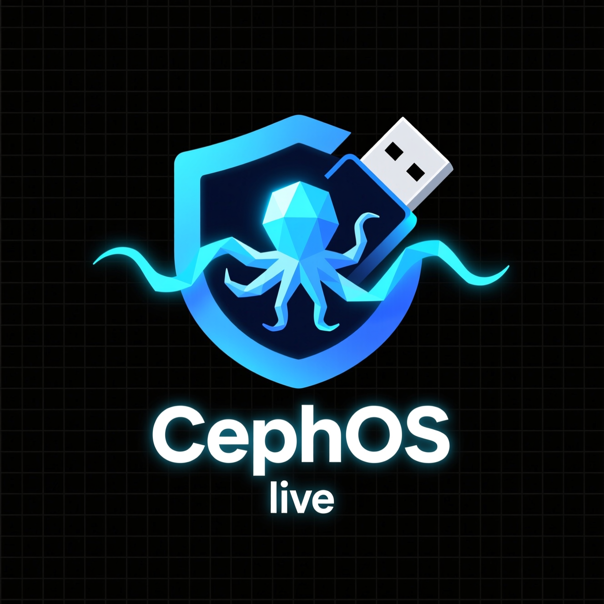

# cephos
CephOS is a Debian Live-based distribution designed for lightweight NAS and SOHO environments.
It boots from a USB flash drive, provisions local disks for Ceph.

The distribution is primarily focused on CephFS, but all Ceph features are still available.

Telegram channel: https://t.me/ceph_os

# Installation on a USB Flash Drive
You need to run `cephos_installer.run`, specifying your target block device (for example, your USB flash drive) as the root device.

The script supports two working modes:
- **write** (default): Write the CephOS image and create persistence partitions.
- **update**: Update an existing installation without recreating persistence partitions.

## Options
- **`-m <mode>`**: Work mode (`write` | `update`). Default is `write`.
- **`-R <device>`**: Root block device (required, e.g. `/dev/sdi`).
- **`-P <device>`**: Root persistence block device. Default: second partition of the root device.
- **`-p "<device:mountpoint;...>"`**: Additional persistence block devices in the format `/dev/sdX:/path;/dev/sdY:/path`.
- **`-s`**: Only write the CephOS image to the block device (skip persistence creation).

## Examples
1. Write image to a device and create a persistence partition on the same device: `./cephos_installer.run -R /dev/sdi`
1. Write image to a device and create a persistence partition on a different device:`./cephos_installer.run -R /dev/sdi -P /dev/sdj`
1. Write image to a device, create persistence on another device, and map additional directories: `./cephos_installer.run -R /dev/sdi -P /dev/sdj -p "/dev/sdm:/var/log;/dev/sdn:/var/cache"`
1. Update image while keeping persistence on the same device: ` ./cephos_installer.run -m update -R /dev/sdi`
1. Write only the CephOS image (no persistence): `./cephos_installer.run -s -R /dev/sdi`

## Notes
The script will create at least one persistence partition. The size of this partition depends on the capacity of the device. Since persistence is intended to store system changes, please avoid using small-capacity flash drives. For testing, a 128GB drive is recommended.

Attention! The usual warning: back up the data from your flash drive first, otherwise it will be lost :)

# Creating the First Node

1. **Configure network interfaces**
   Set up the public and cluster (optional) networks:
   ```bash
   cephos-setup-interface -i ens4 -m 255.255.255.0 -a 192.168.0.10 -n public_0
   cephos-setup-interface -i ens5 -m 255.255.255.0 -a 192.168.1.10 -n ceph_0
   ```

1. **Initialize the host**
   Configure hostname, timezone, and networks:
   ```bash
   cephos-init-host -v -n cf.domain.local -z "Europe/Moscow" -P 192.168.0.0/24 -C 192.168.1.0/24 -p 192.168.0.10 -c 192.168.1.10
   ```

1. **Configure time synchronization**
   Add time servers for cluster synchronization:
   ```bash
   cephos-add-timeserver -v -s 10.0.0.1 -p ru.pool.ntp.org
   ```

1. **Initialize the cluster database**
   Start the initial Ceph cluster configuration:
   ```bash
   cephos-init-cluster -v
   ```

1. **Add block devices**
   Append each device to the cluster:
   ```bash
   cephos-disk-add -v -d /dev/vdb
   cephos-disk-add -v -d /dev/vdc
   ```

1. **Initialize CephFS**
   Set up the Ceph File System:
   ```bash
   cephos-init-cephfs -v
   ```

1. **Enable cluster metrics**
   Initialize monitoring and metric collection:
   ```bash
   cephos-init-metrics -v
   ```

# Joining an Additional Node

1. **Configure network interfaces**
   Set up public and cluster (optional) networks for the new node:
   ```bash
   cephos-setup-interface -i ens4 -m 255.255.255.0 -a 192.168.0.11 -n public_0
   cephos-setup-interface -i ens5 -m 255.255.255.0 -a 192.168.1.11 -n ceph_0
   ```

1. **Initialize the host**
   Assign hostname, timezone, and network settings:
   ```bash
   cephos-init-host -v -n cs.domain.local -z "Europe/Moscow" -P 192.168.0.0/24 -C 192.168.1.0/24 -p 192.168.0.11 -c 192.168.1.11
   ```

1. **Connect to the existing cluster**
   Join the cluster by connecting to the first node:
   ```bash
   cephos-connect-to-cluster -v -n 192.168.0.10
   ```

1. **Add block devices**
   Register local storage devices with the cluster:
   ```bash
   cephos-disk-add -v -d /dev/vdb
   cephos-disk-add -v -d /dev/vdc
   ```

1. **Initialize Metadata Server (MDS)**
   When the node should also participate in CephFS:
   ```bash
   cephos-init-mds -v
   ```

1. **Enable metrics collection**
   Ensure monitoring and telemetry are active:
   ```bash
   cephos-init-metrics -v
   ```


# Defaults
## linux
- Login: cephos
- Password: cephos

The root user password is complex and random. However, the user *cephos* has the ability to use sudo.

## dashboard
- Login: cephos
- Password: P@ssw0rd
